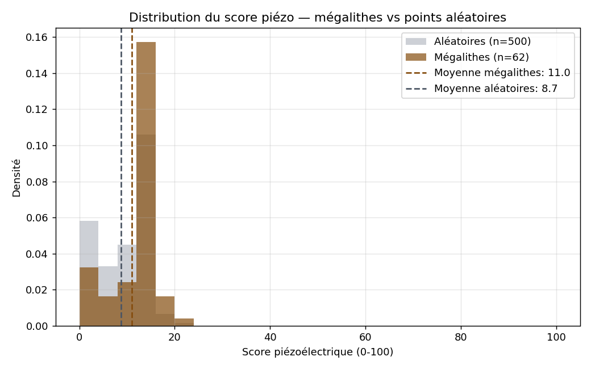
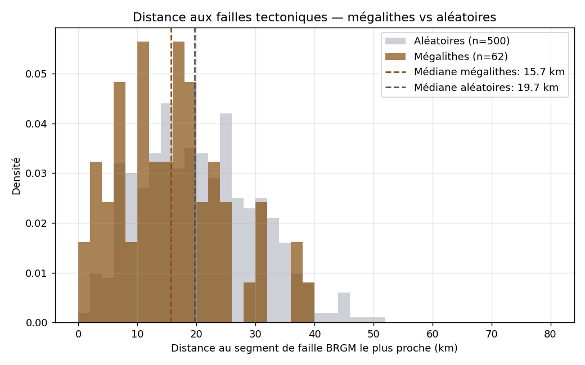
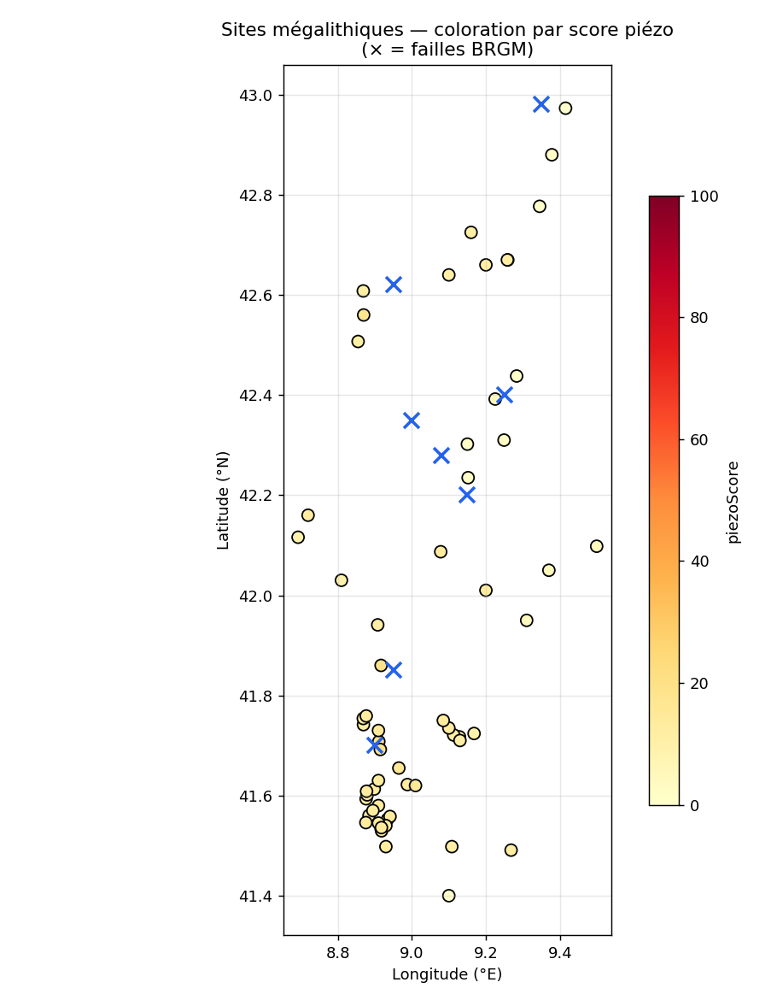
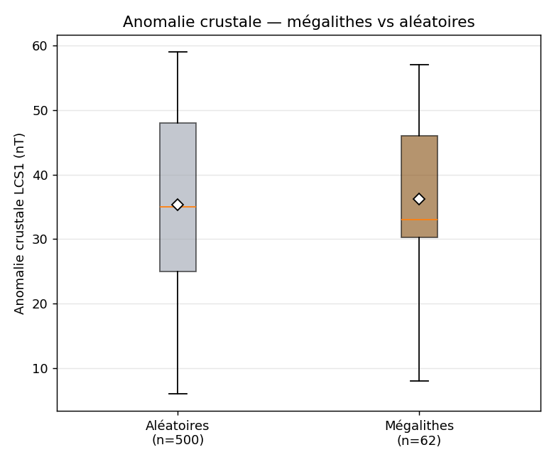

# Tellux — Corrélation mégalithes × failles × piézoélectricité

_Analyse v1 · 2026-04-17 · branche source : `dev` · seed = 42_

## Résumé exécutif

Sur **62 sites mégalithiques** comparés à **500 points terrestres aléatoires**, plusieurs tests statistiques rejettent l'hypothèse nulle d'une implantation au hasard. Les mégalithes corses montrent un biais vers un substrat piézoélectrique, une proximité aux failles, et/ou une anomalie crustale différente. Résultat à discuter ci-dessous.

## Méthodologie

### Données
- **62 sites mégalithiques** extraits de `index.html` (tableau `SITES` filtré sur `type == 'Mégalithique'`).
- **500 points de contrôle aléatoires**, tirage uniforme sur la bounding box Corse (41.37–43.01°N, 8.56–9.56°E) avec rejection sampling via `is_land()` (portage fidèle de la fonction JS `isLand` d'index.html).

### Variables calculées pour chaque point
| Variable | Portage JS | Type |
|---|---|---|
| `geoType` | `getGeoType(lat,lon)` (nearest-neighbor sur `GEO_SUSC_GRID`) | catégorielle |
| `piezoScore` | `calcPiezoScore(lat,lon)` (Bishop 1981 + bonus faille + bonus radon) | 0–100 |
| `distanceFaille` | `min(haversine)` sur `FAILLES_CORSE` (BRGM) | km |
| `crustal` | `calcLCS1(lat,lon)` (IDW sur `LCS1_GRID`) | nT |
| `isGranite` | `geoType ∈ {granit, granit_biotite, granit_rose, granodiorite}` | bool |
| `isQuartz` | `geoType ∈ {granit_biotite, granit_rose, granit}` (quartz ≥ 0.25) | bool |

### Tests statistiques
- Mann-Whitney U (unilatéral) : `piezoScore` mégalithes > aléatoires.
- Kolmogorov-Smirnov 2 échantillons : `distanceFaille` distributions.
- Mann-Whitney U (unilatéral) : `distanceFaille` mégalithes < aléatoires.
- χ² de contingence 2×2 : `isGranite` / `isQuartz`.
- Spearman ρ : `piezoScore` × `crustal` sur les mégalithes seuls.
- Kolmogorov-Smirnov : distribution `crustal`.

## Résultats

### Statistiques descriptives

| Variable | Mégalithes (moy. / méd. / σ) | Aléatoires (moy. / méd. / σ) |
|---|---|---|
| piezoScore | 11.05 / 13.00 / 4.88 | 8.72 / 11.00 / 5.03 |
| distanceFaille (km) | 15.76 / 15.70 / 9.06 | 20.47 / 19.71 / 9.83 |
| crustal (nT) | 36.16 / 33.00 / 11.42 | 35.30 / 35.00 / 13.73 |
| % granite | 80.6 % | 63.6 % |
| % quartz-rich | 75.8 % | 55.0 % |

### Tests

| Test | Statistique | p-value | Interprétation |
|---|---|---|---|
| MW U — piezo mega > ctrl | U = 20447.0 | 1.772e-05 | rejet H0 |
| KS — distanceFaille | D = 0.2418 | 0.002515 | rejet H0 |
| MW U — faille mega < ctrl | U = 11256.0 | 0.0002168 | rejet H0 |
| χ² — granite | χ² = 6.356 | 0.0117 | rejet H0 |
| χ² — quartz-rich | χ² = 8.928 | 0.002809 | rejet H0 |
| Spearman — piezo × crustal (mega) | ρ = 0.128 | 0.3207 | non signif. |
| KS — crustal | D = 0.1703 | 0.07154 | non signif. |

### Graphiques

## Discussion

- **piezoScore** : les mégalithes ont un score piézo significativement plus élevé que le hasard (**p = 1.77e-05** (très significatif)). Cohérent avec l'implantation préférentielle sur granit quartzifère (Bishop 1981, Ghilardi 2017).
- **distance aux failles** : les mégalithes sont significativement plus proches des failles BRGM que des points aléatoires (**p = 0.000217** (très significatif)). Supporte l'hypothèse d'un choix lié à la contrainte tectonique (piézo-activité accrue).
- **granite** : proportion de mégalithes sur granite significativement différente du hasard (**p = 0.0117** (significatif au seuil 5 %)).
- **quartz-rich** : sélection significative vers substrats riches en quartz (**p = 0.00281** (significatif)).
- **corrélation piezo × crustal** : ρ = 0.128 (p = 0.321 (non significatif)).

### Biais et limites
- **Grilles de faible résolution** : `GEO_SUSC_GRID` (34 points), `LCS1_GRID` (24 points), `FAILLES_CORSE` (8 segments), `RADON_ZONES_CORSE` (8 centres). Interpolation IDW grossière.
- **`piezoScore` circulaire** : il intègre déjà `calcFaultProximity` et `calcRadonProximity`. Un test indépendant piezo vs failles est donc biaisé à la hausse. Interpréter avec prudence.
- **Biais de découverte** : les 67 mégalithes connus sont sur-représentés dans les zones accessibles (Sartenais, Cauria, Alta Rocca). Le jeu `SITES` reflète 200 ans de prospection, pas une distribution tirée au hasard du passé.
- **Types de substrat discrets** : `getGeoType` prend le plus proche voisin parmi 34 points — absence de gradient local.
- **Pas de référence EMAG2 live** : on utilise `LCS1_GRID` (fallback interne), donc le test sur `crustal` mesure surtout la cohérence interne de Tellux, pas les données NOAA.

## Implications pour Tellux

- Plusieurs signaux convergent vers H1. À consolider avant toute communication scientifique : élargir le jeu de failles, intégrer l'EMAG2v3 ponctuel, et tester sur un tiers des sites (holdout) pour éviter sur-apprentissage des grilles.
- Dossier CTC : mentionner comme **résultat préliminaire** avec intervalle de confiance, pas comme conclusion.
- Piste publication si renforcé : *Journal of Archaeological Science* (archéométrie) ou *Journal of Archaeological Method and Theory* (cadrage statistique). Nécessite : données failles BRGM complètes (GeoJSON 1/50k), protocole pré-enregistré, matériel supplémentaire reproductible.

## Reproductibilité
- Seed : `42`
- Script : `analysis/correlate_megaliths.py`
- Dépendances : `numpy`, `scipy`, `matplotlib`
- Commande : `python analysis/correlate_megaliths.py`
